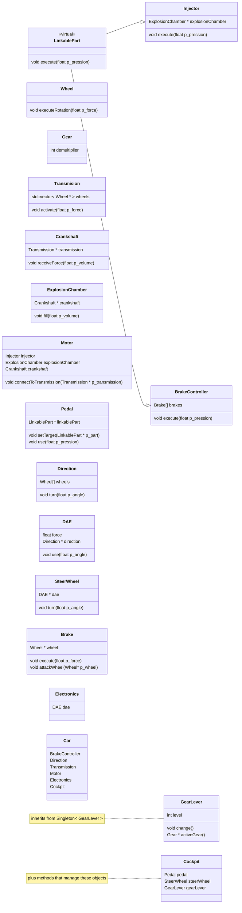

```mermaid

classDiagram
direction LR

class LinkablePart {
    <<virtual>>
    void execute(float p_pression)
}

class Wheel {
    void executeRotation(float p_force)
}

class Gear {
    int demultiplier
}

note for GearLever "inherits from Singleton< GearLever >"
class GearLever {
    int level
    void change()
    Gear * activeGear()
}

class Transmision {
    std::vector< Wheel * > wheels
    void activate (float p_force)
}

class Crankshaft {
    Transmission * transmission
    void receiveForce (float p_volume)
}

class ExplosionChamber {
    Crankshaft * crankshaft
    void fill (float p_volume)
}

class Injector {
    ExplosionChamber * explosionChamber
    void execute (float p_pression)
}

class Motor {
    Injector injector
    ExplosionChamber explosionChamber
    Crankshaft crankshaft
    void connectToTransmission(Transmission * p_transmission)
}

class Pedal {
    LinkablePart * linkablePart
    void setTarget (LinkablePart * p_part)
    void use (float p_pression)
}

class Direction {
    Wheel[] wheels
    void turn (float p_angle)
}

class DAE {
    float force
    Direction * direction
    void use (float p_angle)
}

class SteerWheel {
    DAE * dae
    void turn (float p_angle)
}

class Brake {
    Wheel * wheel
    void execute (float p_force)
    void attackWheel(Wheel* p_wheel)
}

class BrakeController {
    Brake[] brakes
    void execute (float p_pression)
}

note for Cockpit "plus methods that manage these objects"
class Cockpit {
    Pedal pedal
    SteerWheel steerWheel
    GearLever gearLever
}

class Electronics {
    DAE dae
}

class Car {
    BrakeController
    Direction
    Transmission
    Motor
    Electronics
    Cockpit
}


LinkablePart --|> Injector
LinkablePart --|> BrakeController

```